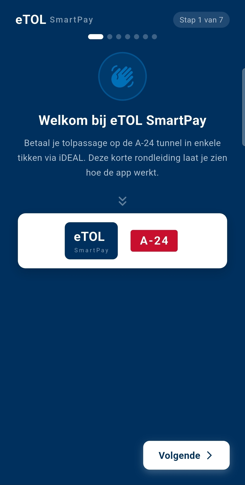
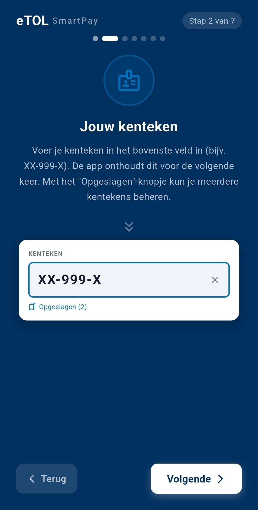
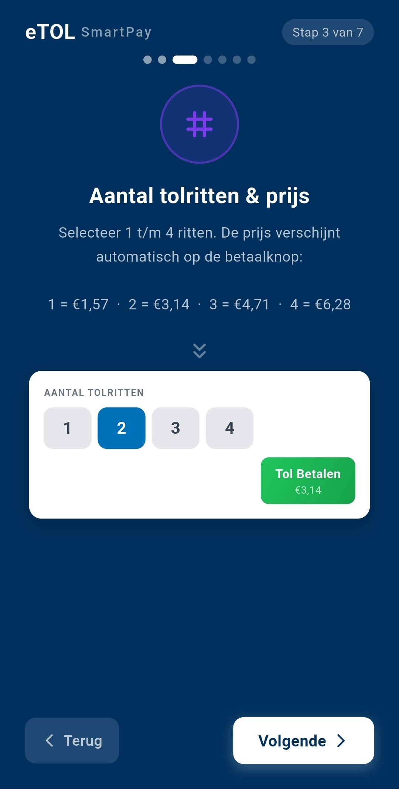
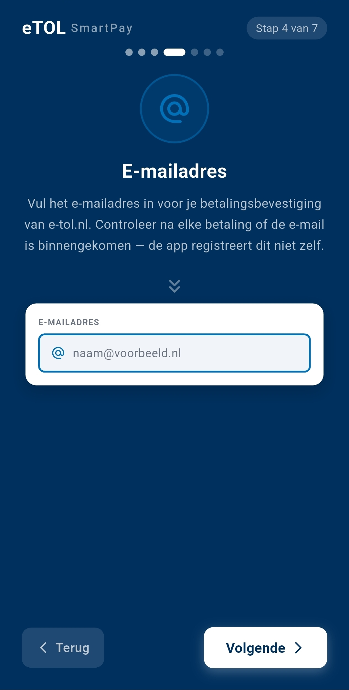
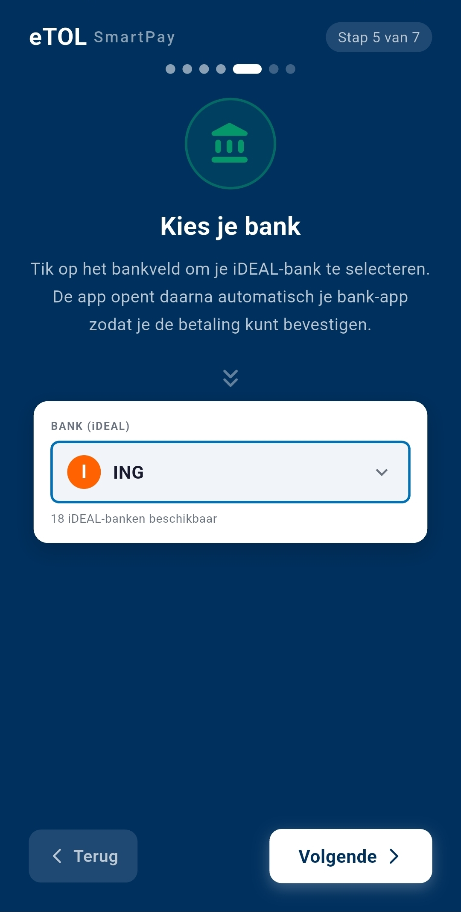
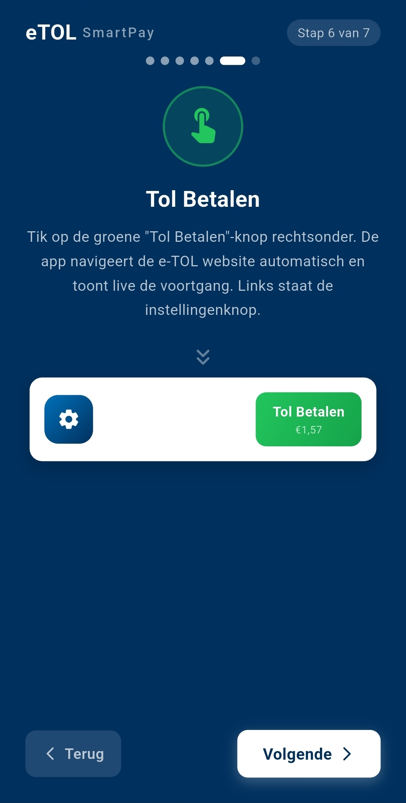

## eTOL SmartPay (Android)

**eTOL SmartPay** is een gebruiksvriendelijke betaalassistent die het invoeren en verwerken van tolbetalingen via de officiële e‑TOL omgeving versnelt en vereenvoudigt.

De app begeleidt gebruikers stap voor stap bij het invoeren van gegevens, zoals kenteken, e‑mail en het aantal ritten. Vervolgens wordt de gebruiker automatisch doorgestuurd naar de officiële e‑TOL betaalomgeving om de betaling via de eigen bank (**iDEAL**) af te ronden.

De volledige betalingstransactie vindt altijd plaats via de officiële e‑TOL website en de beveiligde bankomgeving van de gebruiker. **eTOL SmartPay slaat geen betaalgegevens op** en fungeert uitsluitend als hulpmiddel om het proces sneller, eenvoudiger en betrouwbaarder te maken.

  
  
  

## Functionaliteiten
- 🚗 **Opslaan van meerdere kentekens**  
  Na het afronden van een tolbetaling worden gebruikte kentekens automatisch opgeslagen. Hierdoor bouw je eenvoudig een overzicht op van je voertuigen en kun je bij een volgende betaling snel wisselen tussen kentekens binnen je wagenpark.

- 📧 **Herbruikbaar e-mailadres**  
  Het ingevoerde e-mailadres wordt onthouden, zodat dit niet telkens opnieuw ingevoerd hoeft te worden.

  
  
  

- 📊 **Tolsessie geschiedenis**  
  Inzicht in eerder uitgevoerde tolsessies voor overzicht en controle.

- 🧭 **Eerste keer starten wizard**  
  Een begeleid onboardingproces bij de eerste keer opstarten van de app.
## Belangrijk
- ✅ **Alleen beschikbaar voor Android**
- 🔒 **Geen opslag van gevoelige of financiële gegevens**
- 🌐 **Betaling verloopt volledig via officiële e‑TOL en bankomgeving**

## Disclaimer
Deze applicatie is een **onofficiële Android-applicatie** en staat los van de officiële e‑TOL organisatie.

Het gebruik van eTOL SmartPay is volledig op eigen risico. Hoewel de app is ontworpen om het betaalproces te vereenvoudigen en te ondersteunen, kan er geen garantie worden gegeven op de juistheid, beschikbaarheid of werking van de dienst.

De ontwikkelaar is op geen enkele wijze aansprakelijk voor:
- foutieve invoer van gegevens  
- gemiste betalingen of boetes  
- storingen in de e‑TOL website of betaalomgeving  
- directe of indirecte schade voortvloeiend uit het gebruik van deze applicatie  

Door gebruik te maken van deze app accepteer je deze voorwaarden.

## Privacy & Gegevensverwerking

eTOL SmartPay respecteert de privacy van gebruikers en verwerkt zo min mogelijk gegevens.

- 📱 Gegevens zoals kentekens en e-mailadres worden **alleen lokaal op het apparaat opgeslagen**
- ☁️ Er vindt **geen opslag plaats in externe databases of servers**
- 🔐 Er worden **geen betaalgegevens verwerkt of opgeslagen binnen de app**
- 🌍 Alle betalingen verlopen via de officiële e‑TOL website en de beveiligde omgeving van de bank

De app heeft geen toegang tot gevoelige persoonsgegevens buiten wat strikt noodzakelijk is voor het functioneren van de applicatie.
